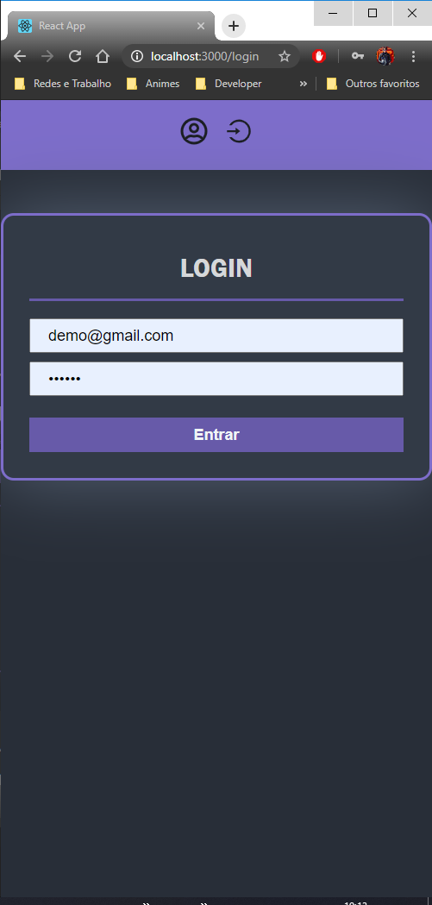
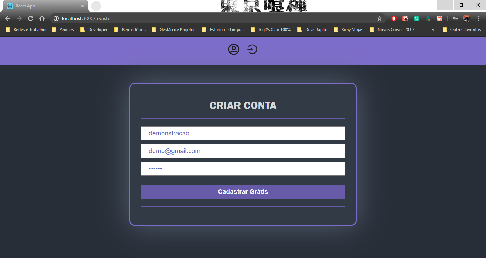
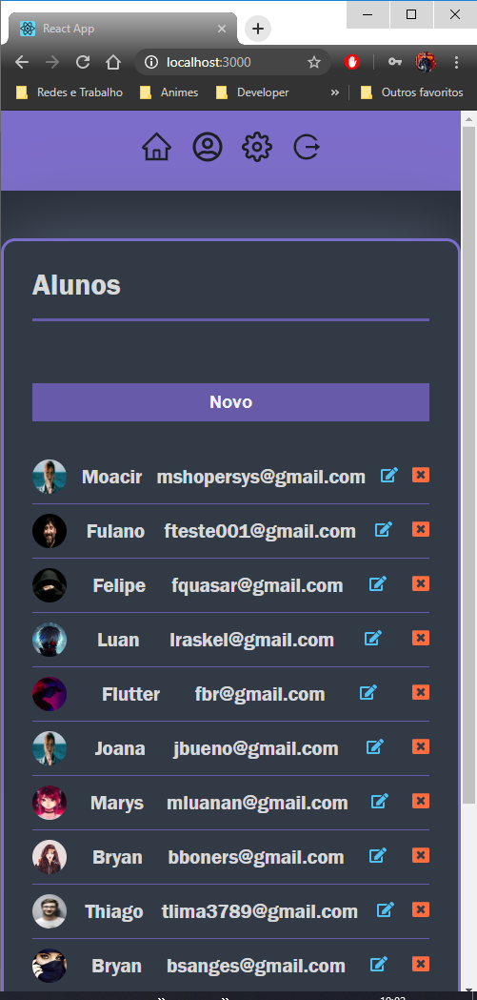
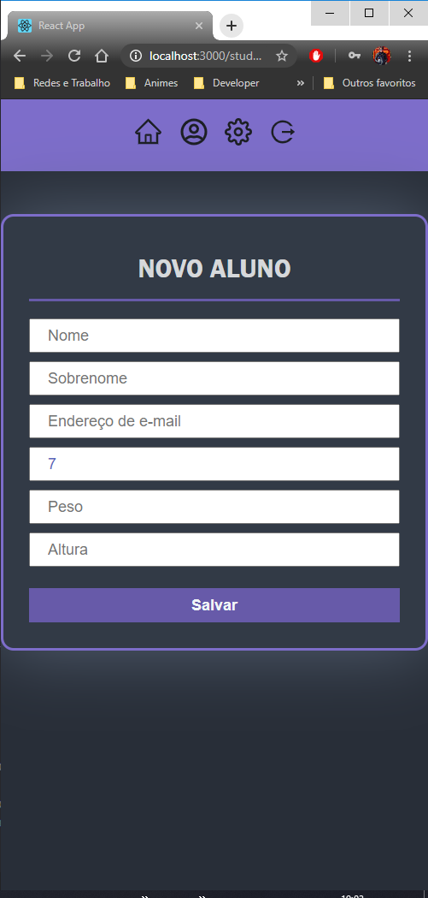
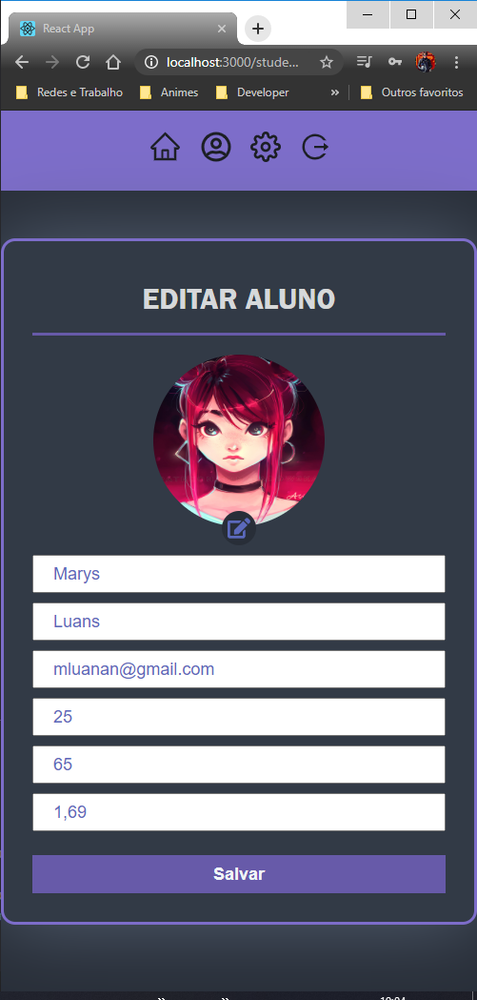
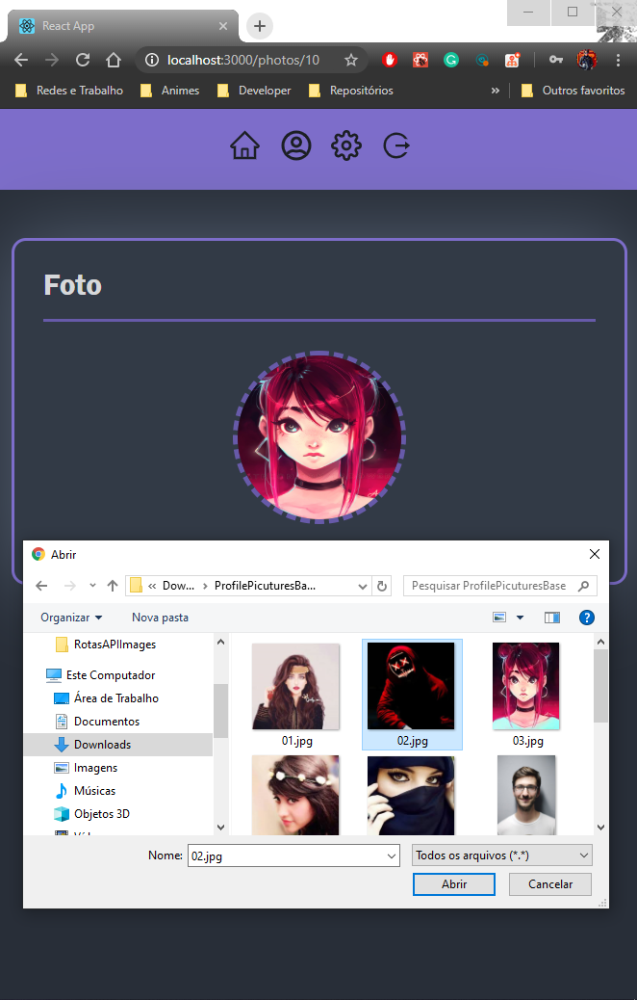

# Escola Virtual ReactJs

---
 Projeto experimental apenas visando o aprimoramento das minhas softskills no frontend usando ES8, Reactjs, Style Components:
 
---
### Instalação
---
````
npm i 
````

## Configuração da fonte de dados
Informe a URL base da API no arquivo src/services/axios:
````
export default axios.create({
  baseURL: 'http://localhost:3001',
});
````

### Criar a tabela no BD
``
CREATE SCHEMA `virtual_school` DEFAULT CHARACTER SET utf8mb4;
``

### Criar Migration/Tabela Students - No terminal digite

``
npx sequelize migration:create --name=students
``

### Criar a Tabela no BD

``
npx sequelize db:migrate
``

## Servidor Frontend
````
npm start
````

### Login:


### Registrar Usuário:


### Listagem de Alunos:


### Menu:


### Alteração:


### Fotos:

